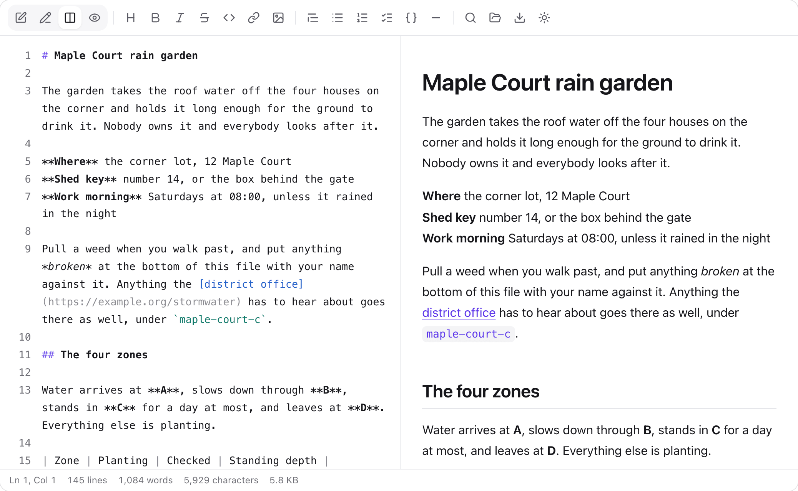

# Mawy

[](https://github.com/jooy2/mawy/blob/main/LICENSE) [](https://www.npmjs.com/package/mawy-react) [](https://www.npmjs.com/package/mawy-react) [](https://pub.dev/packages/mawy) [](https://github.com/jooy2/mawy/actions/workflows/run-test-react.yml) [](https://github.com/jooy2/mawy/actions/workflows/run-test-flutter.yml)

### [**mawy.cdget.com**](https://mawy.cdget.com)

Guides and the full API. This README covers the essentials, and each package has a quick start of its own.

---

**Write a Markdown document, and read it, in the same place.**

Mawy is a Markdown editor and a Markdown viewer standing on one parser and one renderer. It reads CommonMark and GitHub's additions itself, then draws the result as elements rather than handing a page a string of HTML — a document arrives as a tree the application can style, not as markup it has to trust. An author writes in the drawn document or in the source and moves between the two without losing anything on the way. A reader gets that document as it was written, with the typeface, the text size, the line height, the column width and the palette under their own hand.

Drop it into a code editor, a documentation page, a note-taking screen or an AI application, and neither reading nor writing Markdown needs anything else.



## Why Mawy

- **Editor and viewer are the same library.** When a viewer renders differently from the editor that produced the document, authors ship documents that look wrong to readers. Here they share the parser and the renderer, so what you typed is what a reader sees.
- **WYSIWYG and source are two views of one value.** Toggling does not round-trip through a second implementation, so nothing is lost that the other view could not express.
- **The document is drawn, never injected.** Markdown becomes React elements or Flutter widgets directly. There is no `innerHTML` in between, so there is nothing to escape, and every URL is checked against a scheme allowlist whatever else a document contains.
- **The reader sets the typography.** Typeface, size, line height, letter spacing, column width and light or dark, all from the viewer's own toolbar, and reported back so an application can remember what was chosen.
- **One library in two ecosystems.** The Dart parser is a direct translation of the TypeScript one, file for file, and a check in CI diffs both parsers' trees over every Markdown file here. A document that means one thing in a browser means the same thing in an app.
- **Close to zero dependencies.** The parser, the document model, the editing surface and the syntax highlighter are all written here. A third-party library is added only where writing it ourselves would be worse, which today means the toolbar's icons and nothing else. It has to be permissively licensed, and a test in the suite fails the build if a source file imports something undeclared.

## Packages

| Package                                | Registry                                                      | Requires                               | Ships             | Quick start                          |
| -------------------------------------- | ------------------------------------------------------------- | -------------------------------------- | ----------------- | ------------------------------------ |
| [`packages/react`](packages/react)     | [npm: `mawy-react`](https://www.npmjs.com/package/mawy-react) | React 18 or 19, Node.js 20.19 or later | Viewer and editor | [README](packages/react/README.md)   |
| [`packages/flutter`](packages/flutter) | [pub.dev: `mawy`](https://pub.dev/packages/mawy)              | Flutter 3.32 or later, Dart 3.8        | Viewer and editor | [README](packages/flutter/README.md) |

Both packages ship the parser, `MawyViewer` and `MawyEditor` under the same names. The one surface only React has is `wysiwyg`, which edits the drawn document in place; [the editor guide](https://mawy.cdget.com/guide/editor) says why Flutter has the other three and not that one.

The exported names are under semantic versioning, so one that goes away or changes shape waits for a major version. Each language's package **versions independently and keeps its own changelog** beside its own manifest: [`packages/react/CHANGELOG.md`](packages/react/CHANGELOG.md) and [`packages/flutter/CHANGELOG.md`](packages/flutter/CHANGELOG.md). A release on one side is not a release on the other, so the numbers will not always agree.

## Install

```bash
npm install mawy-react
```

`react` and `react-dom` are peer dependencies, and React 18 or 19 is supported. The one runtime dependency is [`lucide-react`](https://lucide.dev), for the toolbar's icons.

```bash
flutter pub add mawy
```

Nothing beyond the Flutter SDK, apart from [`lucide_icons_flutter`](https://pub.dev/packages/lucide_icons_flutter) for the same icons.

## Repository layout

| Path               | What it is                                      | How it is run                                                                        |
| ------------------ | ----------------------------------------------- | ------------------------------------------------------------------------------------ |
| `packages/react`   | The npm package, `mawy-react`                   | `cd packages/react && npm install`, then `npm test`, `npm run lint`, `npm run build` |
| `packages/flutter` | The pub.dev package, `mawy`                     | `cd packages/flutter && flutter pub get`, then `flutter test`, `dart analyze`        |
| `docs`             | The documentation site, shared by both packages | `cd docs && npm install`, then `npm run dev`                                         |

There is no install at the repository root and no root manifest of any kind. Each folder is entered and run on its own. [CONTRIBUTING.md](CONTRIBUTING.md) has the rest.

## Documentation

| Page                                                                | What you will find                                                            |
| ------------------------------------------------------------------- | ----------------------------------------------------------------------------- |
| [**Getting started**](https://mawy.cdget.com/guide/getting-started) | Install and setup, end to end.                                                |
| [**Editor**](https://mawy.cdget.com/guide/editor)                   | The source surface, the preview, and switching between them, with live demos. |
| [**Viewer**](https://mawy.cdget.com/guide/viewer)                   | Rendering a document without editing it, with live demos.                     |
| [**API**](https://mawy.cdget.com/api/)                              | Every component, type and function, one page each.                            |
| [**Changelog**](https://mawy.cdget.com/changelog)                   | What changed in each release.                                                 |

## Contributing

Bug reports, feature requests and pull requests are welcome. [CONTRIBUTING.md](CONTRIBUTING.md) says how, and [CODE_OF_CONDUCT.md](CODE_OF_CONDUCT.md) is the conduct this project holds itself to. For anything with a security impact, do **not** open an issue; [SECURITY.md](SECURITY.md) has the private route.

## License

[MIT](LICENSE) © [CDGet](https://cdget.com)
